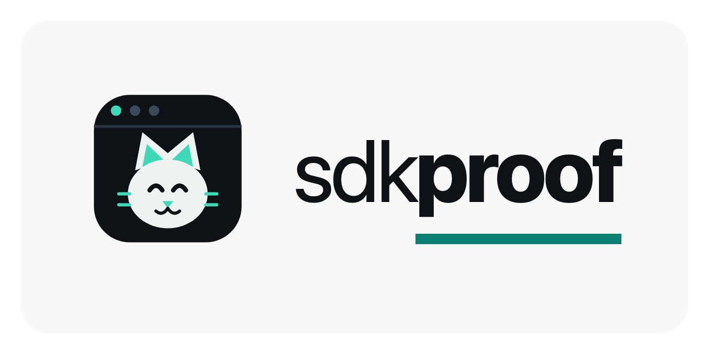

<p align="center">
  
</p>

<p align="center">
  <a href="https://sdkproof.dev"></a>
  &nbsp;
  
</p>

# SDKProof

AI coding assistants write library code from memory. When a library ships a big
release that renames or removes things, the assistant keeps writing the old
version — the code looks right & doesn't compile.

SDKProof measures how often that happens. It gives a model a set of small
realistic coding jobs, then compiles every answer against the real installed
package using `tsc`, the TypeScript compiler.

Pass = it compiles. No AI judges another AI, the compiler decides.

Live board: <https://sdkproof.dev>

## What this looks like in real code

TanStack Table v9 renamed its main hook `useReactTable` to `useTable`, and
renamed the whole row-model family, so `getCoreRowModel` became
`createCoreRowModel`.

Here's the v8 way to build a basic table. It's still what the model reaches
for:

```ts
import { useReactTable, getCoreRowModel, createColumnHelper } from "@tanstack/react-table";

type User = { id: string; name: string };

const helper = createColumnHelper<User>();
const columns = [helper.accessor("id", {}), helper.accessor("name", {})];

export function buildUserTable(data: User[]) {
  return useReactTable({ data, columns, getCoreRowModel: getCoreRowModel() });
}
```

Compiled against the real installed v9.1.2, the TypeScript compiler says:

```
error TS2724: '"@tanstack/react-table"' has no exported member named 'useReactTable'. Did you mean 'ReactTable'?
error TS2724: '"@tanstack/react-table"' has no exported member named 'getCoreRowModel'. Did you mean 'createCoreRowModel'?
error TS2558: Expected 2 type arguments, but got 1.
```

The v9 version that does compile is a different shape. Features are passed in a
map now, and the column helper takes two type arguments:

```ts
import { useTable, createColumnHelper, rowSortingFeature } from "@tanstack/react-table";
import type { ColumnDef } from "@tanstack/react-table";

const features = { rowSortingFeature };
type Features = typeof features;

const helper = createColumnHelper<Features, User>();
const columns: ColumnDef<Features, User, any>[] = [
  helper.accessor("id", { header: "ID" }),
  helper.accessor("name", { header: "Name" }),
];

export function buildUserTable(data: User[]) {
  return useTable<Features, User>({ features, columns, data });
}
```

Nothing about the first one looks broken. You find out when you build.

## How the measurement works

1) **Tasks.** Each library gets 10–15 tasks. A task is a small realistic coding
   job, like "build a table over a list of users & return it". The prompt names
   the function to write, never the option names, so it measures what the model
   reaches for on its own.
2) **Compile.** Each answer is written into a fixture — a small real project
   with that library actually installed — and run through `tsc --noEmit`, which
   builds the file & reports errors without writing any output.
3) **Score.** Pass = the file compiles clean. Any compiler error is a fail. The
   score is passes / tasks on a 0–100 scale, higher is better. 100 means every
   answer compiled.

Failures are not graded by another model. They are the compiler's own error
messages, grouped into patterns.

## The board

Every run below is one model, claude-opus-5, on the package version named in the
last column.

| Library | Package | Score | Compiled | Version | What it gets wrong |
|---|---|:---:|:---:|---|---|
| **TanStack React Table 9** | `@tanstack/react-table` | **0 / 100** | 0 of 12 | 9.1.2 | writes the v8 hook `useReactTable` & the old `getCoreRowModel` family, so not one of the 12 tasks compiled |
| **Vercel AI SDK 7** | `ai` | **71 / 100** | 10 of 14 | 7.0.30 | inline callbacks still infer fine; it breaks when a task annotates the callback types, e.g. `TelemetrySettings` is no longer exported |
| **Prisma 7** | `@prisma/client` | **87 / 100** | 13 of 15 | 7.8.0 | still sets the client up the v6 way — skips v7's now-required driver `adapter`, uses the removed `datasourceUrl` |
| **Next.js 16** | `next` | **92 / 100** | 12 of 13 | 16.2.11 | calls `revalidateTag()` with one argument, Next 16 wants two |
| **React Router 8** | `react-router` | **93 / 100** | 14 of 15 | 8.3.0 | `meta()` still reads the removed `data` argument, it's `loaderData` now |
| **Stripe 22** | `stripe` | **100 / 100** | 10 of 10 | 22.4.0 | nothing on the tasks that ran — but the model refused 5 of 15, so this covers 10 |
| **TanStack Query 5** | `@tanstack/react-query` | **100 / 100** | 13 of 13 | 5.101.4 | nothing, every v4 → v5 change handled |
| **Zod 4** | `zod` | **100 / 100** | 10 of 10 | 4.4.3 | nothing, writes v4 throughout |

A refusal is not a pass & not a fail. The model wrote no code, so nothing about
the library was tested, and those tasks are dropped from the denominator. That's
why Stripe's 100 is out of 10 and not 15.

Full scorecards with the raw compiler errors are in `scorecards/` & on the live site.

## Recency is not what predicts the score

The obvious guess is that the newest big release scores worst. It doesn't work
that way.

What matters is whether the removed thing was still the **recommended** way
until recently. If a library deprecates something, leaves it in for a year and
tells everyone to stop using it, the model has read a thousand migration guides
by the time it's deleted, so it writes the new way.

If a library renames or moves something with no warning, the model still writes
the old name. As far as its training data is concerned, the old name is the
answer, and there is nothing in there saying otherwise.

React Router 8 removed plenty & scores 93, because v8 mostly finished removals
that v7 had already deprecated. TanStack Table 9 renamed the main hook outright
and scores 0.

## Does shipping docs for AI agents fix it?

Some libraries now ship files written for AI coding assistants. It's worth
asking whether they work, so I measured it.

I took three libraries, each with one job the model reliably gets wrong, and
each with a sentence in its own documentation that names the fix. Then I gave
the model that sentence three ways: not at all, on its own, and buried inside
the library's own docs pack. Ten tries per cell, same task, same model, same
installed package.

| Library & the task it fails | No context | The sentence alone | Inside the library's own docs |
|---|:---:|:---:|:---:|
| React Router — the `meta()` argument | 0 / 10 | **10 / 10** (76 B) | 0 / 10 (25 KB pack) |
| Prisma — building the client | 0 / 10 | **10 / 10** (174 B) | 5 / 10 (25 KB pack) |
| Next.js — `revalidateTag` argument count | 0 / 10 | **10 / 10** (137 B) | 10 / 10 (6.6 KB page) |

The sentence works. Every time, all three libraries, from a fix of 76 to 174
bytes. None of them were written for this — each is quoted word for word from
the library's own docs.

What changes is how it reaches the model. React Router already ships that exact
sentence inside a 25 KB pack, and in there it fixes nothing. Next.js serves a
6.6 KB page and it works. So the useful question for a maintainer isn't whether
to write docs for agents. It's whether the answer can be found once it's in
there.

Full write-up, with what is and isn't measured: <https://sdkproof.dev/agent-docs.html>

## How to read a score

**It measures the model, not the library.** A 0 is not a defect in the library's
code, it means this model doesn't know that version yet. A maintainer can't fix
their score by changing their API.

A score is also one model at one moment. New model ships, the number moves up;
the library ships a big release, it moves down. So the board gets re-run rather
than published once.

Two reasons to care, depending on who you are. If you write code with an AI
assistant, this is why it keeps handing you code that won't build, and which
libraries it happens on. If you maintain a library, this is the version of your
API your users' assistants are writing today.

What the score does **not** tell you: whether the library is any good, or
whether the generated code actually does the right thing once it runs.

## What this method can't tell you

Said up front, before anyone asks:

- **One model.** Everything on the board is claude-opus-5. Another model gives
  another board.
- **One shot.** Each task is asked once. No retries, no follow-up, no pasting
  the compiler error back in. A real person would fix most of these on the
  second try.
- **No docs.** The model gets the task and nothing else — no README, no
  `llms.txt`, no web search. That's deliberate, but it makes this a floor, not a
  ceiling.
- **Small numbers.** 10–15 tasks per library. The 95% intervals are wide
  (TanStack Table's 0% is really 0–24%). Read these as directional, not exact.
- **Type-check only.** Passing means it compiles, not that it runs or that it's
  correct. A well-typed wrong answer passes.
- **The tasks are hand-written**, and they aim at the parts of the API that
  changed. A different task set gives a different number.

## Run it yourself

There is no npm package, no `npx`. Clone the repo. Needs Node 20+.

```bash
git clone https://github.com/Kalpitrathore/sdkproof
cd sdkproof
npm install
npm test                              # unit tests
npm start -- run --lib zod --fake     # whole pipeline offline, no API key
```

A real run needs an Anthropic key (a few cents per run):

```bash
cp .env.example .env                  # then add ANTHROPIC_API_KEY
npm start -- run --lib zod
```

Library ids: `zod`, `aisdk`, `prisma`, `nextjs`, `react-router`, `react-table`,
`tanstack-query`, `stripe`. Prisma needs `npm run setup` first, which generates
the client for its fixture.

Results land in `scorecards/<lib>.md` & `data/<lib>.result.json`. Flags:
`--fake` (offline), `--limit N`, `--tasks <file>`, `--trials N`, and
`--with-context`, which re-runs the same tasks with the library's own agent docs
loaded so you can see if the docs close the gap. Set `OPENAI_API_KEY` to score a
GPT model alongside.

## Add a library

1) `npm i <package>`, then create `fixtures/<lib>/tsconfig.json`.
2) Write `fixtures/<lib>/known-good.ts`: code you have confirmed compiles on the
   new version. If the fixture is wrong everything scores 0 for the wrong
   reason, so `npm test` compiles it for you.
3) Add a `LibrarySpec` in `src/libraries/<lib>.ts` & register it in
   `src/libraries/index.ts`.
4) Write `data/<lib>.tasks.json`, some ordinary tasks and some aimed at what the
   new version changed. Then `npm start -- run --lib <lib>`.

The pipeline itself is `src/generate.ts` (task to code), `src/verify.ts` (code
to compiler, the load-bearing bit), `src/classify.ts` (errors to patterns) and
`src/report.ts` (result to scorecard).

---

_Independent analysis. Scorecards are not affiliated with or endorsed by the
libraries scored._
